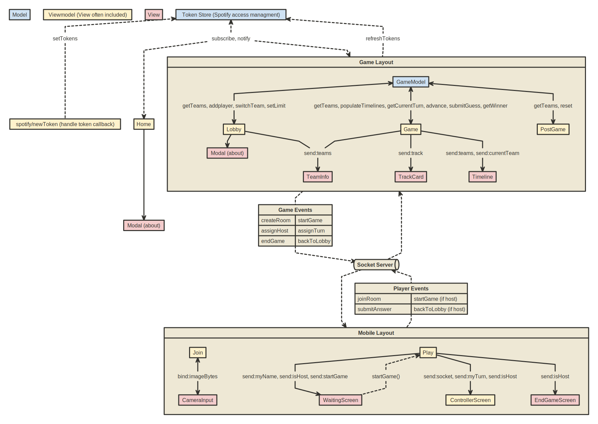

# Beatline 🎉🎉

## Important Information to the Person Grading This Project ⚠️
This app relies heavily on Spotify's web API which has a couple of consequences: 
- To use it, you need a Spotify account
- Since we only have a development license for the API, we need to add the emails of users manually
  - If you want to try the game, you can contact Samuel at samuelfa@kth.se or by your preferred means so he can add your Spotify email.

## Overview

Beatline is a game about placing songs on a time line! Play it with your friends and show them that YOU are the song master.

The projects uses Svelte and Sveltekit for frontend and Express for backend. The gameplay is leveraged using Socket.io and it is all setup with docker to make everyone able to play!

## Technologies Used

- **Svelte/SvelteKit:** For building the interactive frontend.
- **Express:** Used in the backend to set up the server.
- **Socket.io:** Enables real-time, bidirectional and event-based communication.
- **Docker:** Used for containerizing the application.

## Getting Started

These instructions will get you a copy of the project up and running on your local machine for development and testing purposes.

### Prerequisites

Ensure you have the following installed:
- [Git](https://git-scm.com/)
- [Docker](https://www.docker.com/)

### Installation & Setup

1. **Clone the repository**

    First, clone the repository to your local machine. Open your terminal and run:
    ```bash
    git clone git@github.com:DH2643-2023-Group9/Beatline.git
    ```

    Navigate to the project directory:
    ```bash
    cd Beatline
    ```

2. **Configure Environment Variables**

    You need to set up your environment variables before you start the application.

    Inside the frontend directory, create a new file named `.env` and input your variables:
    ```bash
    cd frontend
    touch .env
    ```

    Open `.env` file and insert the environment variables (I sent them on canvas)

3. **Build and Run with Docker**

    Go back to the root of the project directory and use docker-compose to build and start the containers:

    ```bash
    cd ..
    docker-compose up --build
    ```

    This command will build the necessary images and start the containers based on the `docker-compose.yml` file configurations.

## Usage

After your setup is complete, you can visit `http://localhost` in your browser to view the frontend application

## Contribution

Please read [CONTRIBUTING.md](CONTRIBUTING.md) to know who did what in this project

## Grading

We aim for grade C and we sent the google grading criteria in canvas

## Misc

### Architecture Diagram



[Link to editable version](https://nomnoml.com/#view/%23.m%3A%20fill%3D%23cfe2f3%0A%23.vm%3A%20fill%3D%23fff2cc%0A%23.v%3A%20fill%3D%23f4cccc%0A%0A%5B%3Cm%3E%20Model%5D%0A%5B%3Cvm%3E%20Viewmodel%20(View%20often%20included)%5D%0A%5B%3Cv%3E%20View%5D%0A%0A%5B%3Cm%3E%20Token%20Store%20(Spotify%20access%20managment)%5D%0A%0A%5B%3Cvm%3E%20Home%5D%20-%3E%20%5B%3Cv%3E%20Modal%20(about)%5D%0A%5BToken%20Store%20(Spotify%20access%20managment)%5D%20%3C--%5B%3Clabel%3EsetTokens%5D--%20%20%5B%3Cvm%3E%20spotify%2FnewToken%20(handle%20token%20callback)%5D%0A%0A%5BToken%20Store%20(Spotify%20access%20managment)%5D%20%3C--%5B%3Clabel%3Esubscribe%2C%20notify%5D--%3E%20%5BHome%5D%0A%5Bsubscribe%2C%20notify%5D--%3E%20%5BGame%20Layout%5D%0A%5BToken%20Store%20(Spotify%20access%20managment)%5D%20%3C--%5B%3Clabel%3ErefreshTokens%5D--%20%5BGame%20Layout%5D%0A%0A%5BGame%20Layout%7C%0A%09%5B%3Cm%3E%20GameModel%5D%0A%20%20%20%20%5B%3Cvm%3E%20Lobby%5D%0A%20%20%20%20%5B%3Cvm%3E%20Game%5D%0A%20%20%20%20%5B%3Cvm%3E%20PostGame%5D%0A%20%20%20%20%0A%20%20%20%20%5BGameModel%5D%20%3C-%20%5B%3Clabel%3E%20getTeams%2C%20addplayer%2C%20switchTeam%2C%20setLimit%5D%20-%3E%20%5BLobby%5D%0A%20%20%20%20%5BGameModel%5D%20%3C-%20%5B%3Clabel%3E%20getTeams%2C%20populateTimelines%2C%20getCurrentTurn%2C%20advance%2C%20submitGuess%2C%20getWinner%5D-%3E%20%5BGame%5D%0A%20%20%20%20%5BGameModel%5D%20%3C-%20%5B%3Clabel%3E%20getTeams%2C%20reset%5D%20-%3E%20%5BPostGame%5D%0A%20%20%20%20%0A%20%20%20%20%5BLobby%5D%20-%3E%20%5B%3Cv%3E%20Modal%20(about)%5D%0A%20%20%20%20%5BLobby%5D%20-%5B%3Clabel%3Esend%3Ateams%5D-%3E%20%5B%3Cv%3E%20TeamInfo%5D%0A%20%20%20%20%5BGame%5D%20-%5B%3Clabel%3Esend%3Ateams%5D%20%20%20%20%20%20%20%20%20%0A%20%20%20%20%5BGame%5D%20-%5B%3Clabel%3Esend%3Atrack%5D-%3E%20%5B%3Cv%3E%20TrackCard%5D%0A%20%20%20%20%5BGame%5D%20-%5B%3Clabel%3Esend%3Ateams%2C%20send%3AcurrentTeam%5D-%3E%20%5B%3Cv%3E%20Timeline%5D%0A%5D%0A%0A%0A%5BMobile%20Layout%7C%0A%09%5B%3Cvm%3E%20Join%5D%20%3C-%5B%3Clabel%3Ebind%3AimageBytes%5D-%3E%20%5B%3Cv%3E%20CameraInput%5D%0A%20%20%20%20%5B%3Cvm%3E%20Play%5D%20-%5B%3Clabel%3Esend%3AmyName%2C%20send%3AisHost%2C%20send%3AstartGame%5D-%3E%20%5B%3Cv%3E%20WaitingScreen%5D%0A%20%20%20%20%5BPlay%5D%20%3C--%5B%3Clabel%3EstartGame()%5D--%20%5BWaitingScreen%5D%0A%20%20%20%20%5B%3Cvm%3E%20Play%5D%20-%5B%3Clabel%3Esend%3Asocket%2C%20send%3AmyTurn%2C%20send%3AisHost%5D-%3E%20%5B%3Cvm%3E%20ControllerScreen%5D%0A%20%20%20%20%5B%3Cvm%3E%20Play%5D%20-%5B%3Clabel%3Esend%3AisHost%5D-%3E%20%5B%3Cv%3E%20EndGameScreen%5D%0A%5D%0A%0A%0A%5B%3Ctable%3EGame%20Events%7C%0A%09createRoom%20%7C%20startGame%20%7C%7C%20assignHost%20%7C%20assignTurn%20%7C%7C%20endGame%20%7C%20backToLobby%0A%5D%0A%5B%3Cpipe%3ESocket%20Server%5D%0A%5B%3Ctable%3EPlayer%20Events%7C%0A%09joinRoom%20%7C%20startGame%20(if%20host)%20%7C%7C%20submitAnswer%20%7C%20backToLobby%20(if%20host)%0A%5D%0A%0A%5BGame%20Layout%5D%20--%5BGame%20Events%5D%20--%3E%20%5BSocket%20Server%5D%0A%5BGame%20Layout%5D%20%3C--%20%5BSocket%20Server%5D%0A%5BSocket%20Server%5D%20--%3E%20%5BMobile%20Layout%5D%0A%5BSocket%20Server%5D%20%3C--%20%5BPlayer%20Events%5D%20--%20%5BMobile%20Layout%5D%0A%0A%0A)
